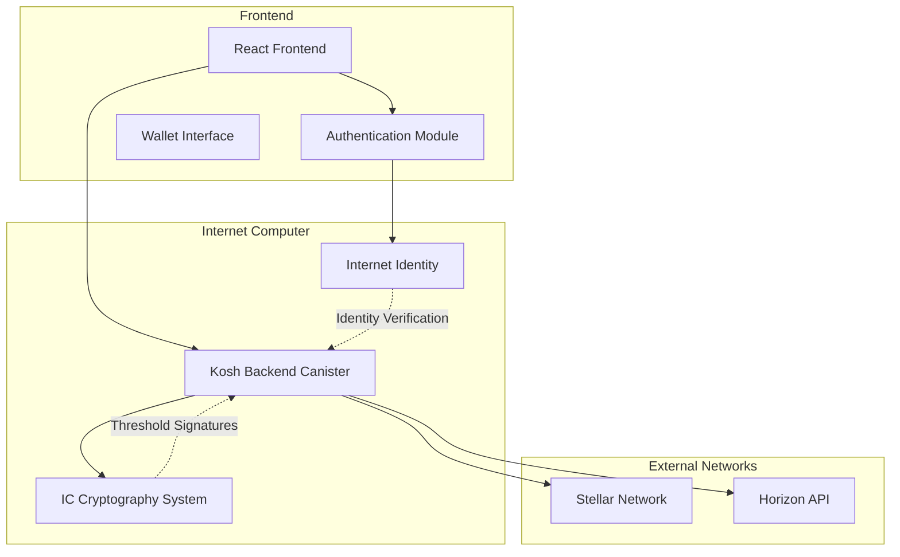

# KOSH - Keyless Crypto Wallet

[](https://internetcomputer.org/)
[](https://stellar.org/)
[](https://www.rust-lang.org/)
[](https://reactjs.org/)

> A truly decentralized, keyless cryptocurrency wallet powered by Internet Computer's threshold cryptography and Internet Identity.

## 🌟 Overview

Kosh is a revolutionary cryptocurrency wallet that eliminates the need for seed phrases, private keys, or traditional wallet management. Built on the Internet Computer (IC) platform, it leverages cutting-edge threshold cryptography to provide secure, decentralized access to your crypto assets.

### Key Features

- 🔐 **Keyless Architecture**: No seed phrases or private keys to manage
- 🌐 **Internet Identity Integration**: Secure authentication without passwords
- ⭐ **Stellar Blockchain Support**: Full transaction capabilities on Stellar network
- 🤖 **AI Auto-Staking**: Intelligent staking optimization (coming soon)
- 🔗 **Multi-Chain Ready**: Extensible architecture for Bitcoin, Ethereum, Solana
- 🛡️ **Threshold Cryptography**: Distributed key management via IC consensus
- 💎 **Modern UI/UX**: Beautiful, responsive interface with dark mode
- 🚀 **Lightning Fast**: Sub-second transaction signing and submission

## 🏗️ Architecture



### Core Components

#### 1. **Backend Canister** (`src/kosh_backend/`)
- **Language**: Rust
- **Platform**: Internet Computer
- **Responsibilities**:
  - Threshold signature generation using IC management canister
  - Stellar transaction building and signing
  - Account balance querying
  - Secure key derivation from user's Internet Identity

#### 2. **Frontend Application** (`src/kosh_frontend/`)
- **Framework**: React + Vite
- **Styling**: Tailwind CSS + Custom SCSS
- **Authentication**: Internet Identity integration
- **Features**:
  - Wallet interface with send/receive functionality
  - Real-time balance checking
  - Transaction history and status
  - Multi-network support (Stellar, Bitcoin, Ethereum, Solana)

#### 3. **Threshold Cryptography**
- Uses Internet Computer's native threshold ECDSA/Ed25519
- Keys are never stored or exposed - generated on-demand
- Signatures are created through consensus of IC subnet nodes
- Each user gets a unique key derivation path based on their principal

## 🚀 Getting Started

### Prerequisites

- **Node.js** (≥16.0.0)
- **npm** (≥7.0.0)
- **DFX** (DFINITY Canister SDK)
- **Rust** (for backend development)

### Installation

1. **Clone the repository**
   ```bash
   git clone <repository-url>
   cd kosh
   ```

2. **Install dependencies**
   ```bash
   npm install
   ```

3. **Start local IC replica**
   ```bash
   dfx start --background
   ```

4. **Deploy canisters**
   ```bash
   dfx deploy
   ```

5. **Start frontend development server**
   ```bash
   npm start
   ```

6. **Access the application**
   - Local development: `http://localhost:8080`
   - Production: `http://localhost:4943?canisterId={asset_canister_id}`

### Quick Setup Script

For a complete setup from scratch:

```bash
cd kosh/
npm run setup  # Installs deps, creates canisters, generates bindings, and deploys
```

## 📖 Usage Guide

### 1. **Authentication**

Kosh uses Internet Identity for secure, passwordless authentication:

1. Click "Connect with Internet Identity"
2. Choose your preferred authentication method:
   - Browser-based passkey
   - Hardware security key (YubiKey, etc.)
   - Recovery phrase (if previously set up)
3. Approve the application access

### 2. **Wallet Operations**

#### **Getting Your Stellar Address**
- Your Stellar address is automatically generated upon first login
- Each Internet Identity gets a unique, deterministic Stellar address
- Address format: `G...` (Stellar mainnet) or testnet equivalent

#### **Checking Balance**
- Click the eye icon to show/hide balance
- Balances are fetched in real-time from Stellar network
- Supports both funded and unfunded accounts

#### **Sending Transactions**
1. Click "Send" button
2. Enter destination Stellar address (`G...`)
3. Specify amount in XLM
4. Confirm transaction
5. Transaction is automatically signed and submitted to network

#### **Receiving Funds**
1. Click "Receive" button
2. Copy your Stellar address
3. Share with sender or use for funding

### 3. **Network Support**

Currently supported:
- ✅ **Stellar Testnet** (fully functional)
- 🔄 **Stellar Mainnet** (coming soon)

Planned networks:
- 🔄 **Bitcoin** (in development)
- 🔄 **Ethereum** (in development)  
- 🔄 **Solana** (in development)

## 🔧 Development

### Project Structure

```
kosh/
├── src/
│   ├── kosh_backend/           # Rust backend canister
│   │   ├── src/lib.rs         # Main backend logic
│   │   ├── Cargo.toml         # Rust dependencies
│   │   └── kosh_backend.did   # Candid interface
│   └── kosh_frontend/         # React frontend
│       ├── src/
│       │   ├── App.jsx        # Main application
│       │   ├── useAuth.js     # Authentication hook
│       │   ├── components/    # UI components
│       │   └── lib/           # Utility functions
│       ├── package.json       # Frontend dependencies
│       └── vite.config.js     # Vite configuration
├── dfx.json                   # IC project configuration
├── package.json               # Workspace configuration
└── README.md                  # This file
```

### Backend API

The backend canister exposes the following methods:

```candid
service : {
  // Get user's Stellar public address
  public_key_stellar : () -> (Result);
  
  // Check account balance on Stellar network
  get_account_balance : () -> (Result);
  
  // Build, sign, and submit Stellar transaction
  build_stellar_transaction : (text, nat64) -> (Result);
  
  // Test function
  greet : (text) -> (text) query;
}

type Result = variant { Ok : text; Err : text };
```

### Key Technologies

#### **Backend Dependencies**
- `ic-cdk`: Internet Computer development kit
- `stellar-xdr`: Stellar transaction encoding/decoding
- `base32`/`base64`: Address encoding
- `sha2`: Cryptographic hashing
- `serde_json`: JSON serialization

#### **Frontend Dependencies**
- `@dfinity/agent`: IC agent for canister communication
- `@dfinity/auth-client`: Internet Identity integration
- `react`: UI framework
- `tailwindcss`: Utility-first CSS
- `vite`: Fast build tool

### Building for Production

1. **Build all components**
   ```bash
   npm run build
   ```

2. **Deploy to IC mainnet**
   ```bash
   dfx deploy --network ic
   ```

## 🔐 Security Features

### Threshold Cryptography
- **No Single Point of Failure**: Keys are distributed across IC subnet nodes
- **Consensus-Based Signing**: Requires agreement from majority of nodes
- **Non-Extractable Keys**: Private keys never exist in complete form anywhere

### Internet Identity Integration
- **Biometric Authentication**: Supports WebAuthn/FIDO2 standards
- **Hardware Security Keys**: YubiKey and similar devices supported
- **Recovery Mechanisms**: Secure account recovery without seed phrases

### Best Practices Implemented
- **Derivation Path Isolation**: Each user gets unique key derivation
- **Network ID Verification**: Prevents cross-network transaction replay
- **Input Validation**: All user inputs are validated before processing
- **Error Handling**: Comprehensive error reporting and recovery

## 🌐 Network Configuration

### Stellar Network Settings

#### **Testnet** (Default)
- Network Passphrase: `"Test SDF Network ; September 2015"`
- Horizon URL: `https://horizon-testnet.stellar.org`
- Native Asset: XLM
- Transaction Fees: 100 stroops (0.00001 XLM)

#### **Mainnet** (Coming Soon)
- Network Passphrase: `"Public Global Stellar Network ; September 2015"`
- Horizon URL: `https://horizon.stellar.org`
- Native Asset: XLM

### Canister Configuration

The application consists of three main canisters:

1. **kosh_backend**: Main application logic
2. **kosh_frontend**: Static web assets
3. **internet_identity**: Authentication service

## 🚨 Troubleshooting

### Common Issues

#### **"Address not available" Error**
- **Cause**: Wallet generation failed or IC connection issue
- **Solution**: Refresh page or check IC network status

#### **"Account not found (unfunded)" Balance**
- **Cause**: Stellar account hasn't received any funds yet
- **Solution**: Fund account with minimum 1 XLM to activate

#### **Transaction Submission Failures**
- **Cause**: Network issues, insufficient balance, or malformed transaction
- **Solution**: Check balance, verify destination address, retry

#### **Internet Identity Login Issues**
- **Cause**: Browser compatibility or II service unavailability
- **Solution**: Try different browser, clear cache, or wait for service restoration

### Development Issues

#### **DFX Deploy Failures**
```bash
# Reset local replica state
dfx stop
dfx start --clean --background
dfx deploy
```

#### **Frontend Build Issues**
```bash
# Clear node modules and reinstall
rm -rf node_modules package-lock.json
npm install
```

#### **Canister Call Failures**
- Check canister IDs match in frontend configuration
- Verify network connectivity to IC
- Ensure proper authentication state

## 🎯 Roadmap

### Phase 1: Core Foundation ✅
- [x] Internet Identity integration
- [x] Stellar testnet support
- [x] Basic wallet operations (send/receive)
- [x] Threshold signature implementation

### Phase 2: Enhanced Features 🔄
- [ ] Stellar mainnet deployment
- [ ] AI-powered staking optimization
- [ ] Transaction history and analytics
- [ ] Multi-asset support within Stellar

### Phase 3: Multi-Chain Expansion 📋
- [ ] Bitcoin integration
- [ ] Ethereum support
- [ ] Solana network
- [ ] Cross-chain bridge functionality

### Phase 4: Advanced Features 📋
- [ ] DeFi protocol integrations
- [ ] NFT management
- [ ] Social recovery mechanisms
- [ ] Mobile application

## 🤝 Contributing

We welcome contributions! Please see our contributing guidelines:

1. Fork the repository
2. Create a feature branch
3. Make your changes
4. Add tests if applicable
5. Submit a pull request

### Development Setup for Contributors

```bash
# Clone your fork
git clone <your-fork-url>
cd kosh

# Create development branch
git checkout -b feature/your-feature-name

# Set up development environment
npm install
dfx start --background
dfx deploy

# Start development server
npm start
```

## 📄 License

This project is licensed under the MIT License - see the [LICENSE](LICENSE) file for details.

## 📞 Support

- **Documentation**: [Internet Computer Docs](https://internetcomputer.org/docs)
- **Community**: [DFINITY Forum](https://forum.dfinity.org)
- **Issues**: [GitHub Issues](../../issues)

## 🙏 Acknowledgments

- **DFINITY Foundation** for the Internet Computer platform
- **Stellar Development Foundation** for the Stellar network
- **Internet Identity Team** for secure authentication infrastructure
- **Open Source Community** for various libraries and tools used

---

Built with ❤️ on the Internet Computer
