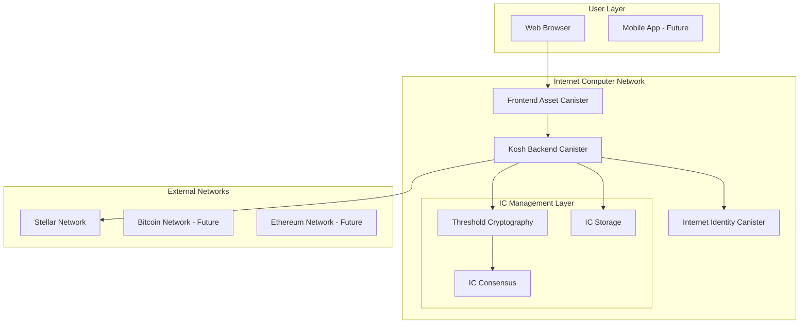
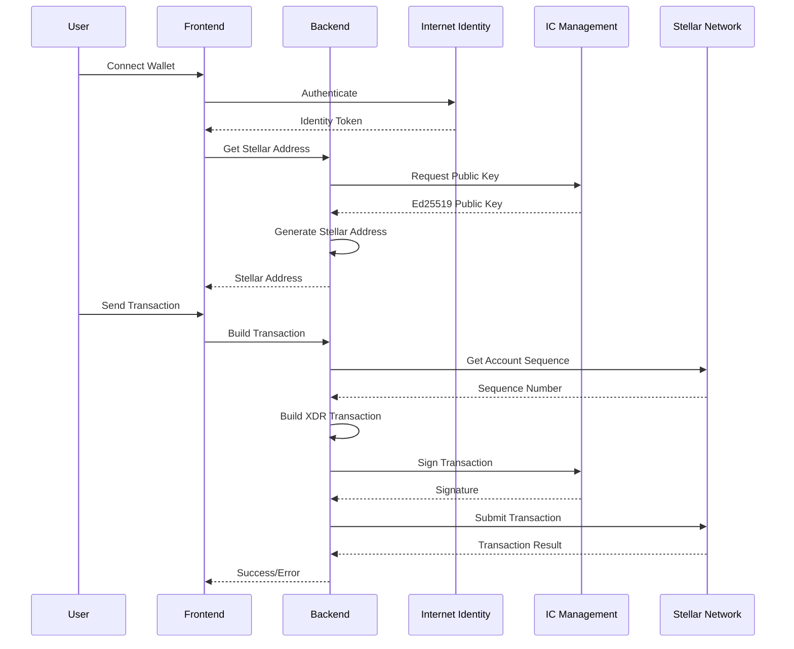

# Kosh Technical Documentation

## Table of Contents
- [Architecture Overview](#architecture-overview)
- [Backend Implementation](#backend-implementation)
- [Frontend Implementation](#frontend-implementation)
- [Cryptographic Design](#cryptographic-design)
- [API Specifications](#api-specifications)
- [Security Analysis](#security-analysis)
- [Performance Considerations](#performance-considerations)
- [Deployment Guide](#deployment-guide)
- [Testing Framework](#testing-framework)
- [Troubleshooting Guide](#troubleshooting-guide)

## Architecture Overview

### System Architecture

Kosh implements a three-tier architecture leveraging Internet Computer's unique capabilities:



### Component Interaction Flow



## Backend Implementation

### Core Canister Structure

```rust
// Main exports and types
pub use crate::{
    greet,
    public_key_stellar,
    build_stellar_transaction,
    get_account_balance,
};

// Key management
type CanisterId = Principal;

#[derive(CandidType, Serialize, Debug, Clone)]
struct SchnorrKeyId {
    pub algorithm: SchnorrAlgorithm,
    pub name: String,
}
```

### Stellar Address Generation

#### Algorithm Overview
1. **Key Derivation**: Generate Ed25519 public key using IC threshold cryptography
2. **Version Prefix**: Add Stellar account version byte (0x30)
3. **Checksum**: Calculate CRC16-XModem checksum
4. **Encoding**: Base32 encode with RFC4648 alphabet

#### Implementation Details

```rust
async fn public_key_stellar() -> Result<String, String> {
    // 1. Request public key from IC management canister
    let request = ManagementCanisterSchnorrPublicKeyRequest {
        canister_id: None,
        derivation_path: vec![ic_cdk::api::caller().as_slice().to_vec()],
        key_id: SchnorrKeyId {
            algorithm: SchnorrAlgorithm::Ed25519,
            name: String::from("test_key_1"),
        },
    };
    
    // 2. Get raw 32-byte Ed25519 public key
    let (res,): (ManagementCanisterSchnorrPublicKeyReply,) = ic_cdk::call(
        Principal::management_canister(),
        "schnorr_public_key",
        (request,),
    ).await?;
    
    // 3. Format as Stellar address
    let version_byte = 0x30;
    let mut data_with_version = vec![version_byte];
    data_with_version.extend_from_slice(&res.public_key);
    
    // 4. Add CRC16 checksum
    let mut state = State::<XMODEM>::new();
    state.update(&data_with_version);
    let checksum = state.get().to_le_bytes();
    data_with_version.extend_from_slice(&checksum);
    
    // 5. Base32 encode
    let stellar_address = base32::encode(
        Alphabet::RFC4648 { padding: false }, 
        &data_with_version
    );
    
    Ok(stellar_address)
}
```

### Transaction Building and Signing

#### XDR Transaction Construction

```rust
async fn build_stellar_transaction(
    destination_address: String,
    amount: u64,
) -> Result<String, String> {
    // 1. Get source account details
    let source_address = public_key_stellar().await?;
    let sequence = get_sequence_number(&source_address).await?;
    
    // 2. Build payment operation
    let payment_op = PaymentOp {
        destination: decode_stellar_address(&destination_address)?,
        asset: Asset::Native,
        amount: (amount * 10_000_000) as i64, // Convert XLM to stroops
    };
    
    // 3. Create transaction envelope
    let transaction = Transaction {
        source_account: decode_stellar_address(&source_address)?,
        fee: 100, // 100 stroops
        seq_num: SequenceNumber(sequence + 1),
        cond: Preconditions::Time(TimeBounds {
            min_time: TimePoint(0),
            max_time: TimePoint(0),
        }),
        memo: Memo::None,
        operations: vec![Operation {
            source_account: None,
            body: OperationBody::Payment(payment_op),
        }].try_into()?,
        ext: TransactionExt::V0,
    };
    
    // 4. Sign and submit
    sign_and_submit_transaction(transaction).await
}
```

#### Threshold Signature Process

```rust
async fn sign_transaction_stellar(xdr_base64: String) -> Result<String, String> {
    // 1. Parse XDR transaction
    let envelope = TransactionEnvelope::read_xdr(&mut xdr_bytes.as_slice())?;
    
    // 2. Create signature payload
    let network_passphrase = "Test SDF Network ; September 2015";
    let network_id = Sha256::digest(network_passphrase.as_bytes());
    
    let payload = TransactionSignaturePayload {
        network_id: Hash(network_id.try_into()?),
        tagged_transaction: TransactionSignaturePayloadTaggedTransaction::Tx(tx),
    };
    
    // 3. Hash the payload
    let hash = Sha256::digest(&payload_bytes);
    
    // 4. Request signature from IC
    let signature_request = ManagementCanisterSignatureRequest {
        message: hash.to_vec(),
        derivation_path: vec![ic_cdk::api::caller().as_slice().to_vec()],
        key_id: SchnorrKeyId {
            algorithm: SchnorrAlgorithm::Ed25519,
            name: String::from("test_key_1"),
        },
    };
    
    let (signature_reply,): (ManagementCanisterSignatureReply,) =
        ic_cdk::api::call::call_with_payment(
            Principal::management_canister(),
            "sign_with_schnorr",
            (signature_request,),
            26_153_846_153, // Cycles for signing
        ).await?;
    
    // 5. Create decorated signature and attach to transaction
    let decorated_sig = DecoratedSignature {
        hint: create_signature_hint(&public_key),
        signature: Signature(signature_reply.signature.try_into()?),
    };
    
    // 6. Submit to Stellar network
    submit_to_stellar_network(signed_envelope).await
}
```

### Network Communication

#### Stellar Horizon API Integration

```rust
async fn get_sequence_number(public_key: &str) -> Result<i64, String> {
    let url = format!(
        "https://horizon-testnet.stellar.org/accounts/{}",
        public_key
    );
    
    let response = ic_cdk::api::management_canister::http_request::http_request(
        CanisterHttpRequestArgument {
            url: url.clone(),
            method: HttpMethod::GET,
            body: None,
            max_response_bytes: Some(10_000),
            transform: None,
            headers: vec![],
        },
        50_000_000_000, // 50B cycles
    ).await?;
    
    let account: AccountResponse = serde_json::from_str(&response_body)?;
    account.sequence.parse::<i64>()
}

async fn submit_transaction(signed_xdr: String) -> Result<String, String> {
    let encoded_xdr = form_urlencoded::byte_serialize(signed_xdr.as_bytes())
        .collect::<String>();
    let request_body = format!("tx={}", encoded_xdr);
    
    let response = ic_cdk::api::management_canister::http_request::http_request(
        CanisterHttpRequestArgument {
            url: "https://horizon-testnet.stellar.org/transactions".to_string(),
            method: HttpMethod::POST,
            body: Some(request_body.into_bytes()),
            max_response_bytes: Some(10_000),
            transform: None,
            headers: vec![HttpHeader {
                name: "Content-Type".to_string(),
                value: "application/x-www-form-urlencoded".to_string(),
            }],
        },
        50_000_000_000, // 50B cycles
    ).await?;
    
    String::from_utf8(response.0.body)
}
```

## Frontend Implementation

### Authentication Architecture

#### Internet Identity Integration

```javascript
// useAuth.js - Core authentication hook
export const useAuth = () => {
  const [authClient, setAuthClient] = useState(null);
  const [isAuthenticated, setIsAuthenticated] = useState(false);
  const [principal, setPrincipal] = useState(null);
  const [actor, setActor] = useState(null);

  const initializeAuth = async () => {
    try {
      // Create Internet Identity client
      const client = await AuthClient.create();
      setAuthClient(client);
      
      // Check existing authentication
      const isAuth = await client.isAuthenticated();
      setIsAuthenticated(isAuth);
      
      if (isAuth) {
        const identity = client.getIdentity();
        setPrincipal(identity.getPrincipal());
        
        // Create authenticated actor
        const authenticatedActor = createActor(CANISTER_IDS.BACKEND, {
          agentOptions: {
            identity,
            host: getHost()
          },
        });
        setActor(authenticatedActor);
      }
    } catch (error) {
      console.error('Error initializing auth:', error);
    }
  };

  const login = async () => {
    await authClient.login({
      identityProvider: getIdentityProvider(),
      onSuccess: handleLoginSuccess,
    });
  };
};
```

#### Actor Management

```javascript
// Dynamic canister actor creation
const createActor = (canisterId, options) => {
  const agent = new HttpAgent({
    ...options.agentOptions,
  });
  
  // Fetch root key in development
  if (process.env.NODE_ENV !== 'production') {
    agent.fetchRootKey().catch(err => {
      console.warn('Unable to fetch root key:', err);
    });
  }
  
  return Actor.createActor(idlFactory, {
    agent,
    canisterId,
  });
};
```

### State Management

#### Wallet State Architecture

```javascript
// App.jsx - Main application state
const [walletState, setWalletState] = useState({
  // Authentication
  isAuthenticated: false,
  principal: null,
  actor: null,
  loading: false,
  
  // Wallet data
  stellarAddress: null,
  balance: null,
  balanceLoading: false,
  balanceVisible: false,
  
  // UI state
  selectedNetwork: 'stellar-mainnet',
  modals: {
    send: false,
    receive: false,
    settings: false,
  },
  
  // Transaction state
  transactionResult: null,
  transactionLoading: false,
});
```

#### Address Caching Strategy

```javascript
// User-specific address caching
useEffect(() => {
  if (principal) {
    const cacheKey = `kosh_stellar_address_${principal.toString()}`;
    const cachedAddress = localStorage.getItem(cacheKey);
    
    if (cachedAddress) {
      try {
        const parsed = JSON.parse(cachedAddress);
        setStellarAddress(parsed);
      } catch (error) {
        localStorage.removeItem(cacheKey);
        generateNewAddress();
      }
    } else {
      generateNewAddress();
    }
  }
}, [principal]);

const cacheAddress = (address, userPrincipal) => {
  const cacheKey = `kosh_stellar_address_${userPrincipal}`;
  localStorage.setItem(cacheKey, JSON.stringify({
    stellar_address: address,
    timestamp: Date.now(),
  }));
};
```

### Transaction Flow

#### Send Transaction Implementation

```javascript
const handleSendTransaction = async () => {
  if (!paymentForm.destination || !paymentForm.amount) {
    throw new Error('Please fill in all fields');
  }

  setTransactionLoading(true);
  try {
    // Validate Stellar address format
    if (!isValidStellarAddress(paymentForm.destination)) {
      throw new Error('Invalid Stellar address format');
    }
    
    // Convert amount to u64 format
    const amountU64 = BigInt(Math.floor(parseFloat(paymentForm.amount)));
    
    // Call backend to build, sign, and submit
    const result = await actor.build_stellar_transaction(
      paymentForm.destination, 
      amountU64
    );
    
    if (result.Ok) {
      setTransactionResult({
        success: true,
        message: 'Transaction submitted successfully!',
        transactionHash: extractTransactionHash(result.Ok),
        timestamp: new Date().toLocaleString()
      });
      
      // Reset form and refresh balance
      setPaymentForm({ destination: '', amount: '' });
      setTimeout(refreshBalance, 2000);
    } else {
      throw new Error(result.Err);
    }
  } catch (error) {
    setTransactionResult({
      success: false,
      message: error.message,
      timestamp: new Date().toLocaleString()
    });
  } finally {
    setTransactionLoading(false);
  }
};
```

### UI Component Architecture

#### Modern Gradient Design System

```scss
// Advanced gradient system
.action-card {
  position: relative;
  background: linear-gradient(135deg, 
    rgba(255, 255, 255, 0.1) 0%, 
    rgba(255, 255, 255, 0.05) 100%);
  border: 1px solid rgba(255, 255, 255, 0.1);
  border-radius: 16px;
  backdrop-filter: blur(20px);
  
  &::before {
    content: '';
    position: absolute;
    inset: 0;
    padding: 1px;
    background: linear-gradient(135deg, 
      rgba(139, 92, 246, 0.5), 
      rgba(59, 130, 246, 0.5));
    border-radius: inherit;
    mask: linear-gradient(#fff 0 0) content-box, 
          linear-gradient(#fff 0 0);
    mask-composite: subtract;
  }
  
  .action-hover-glow {
    position: absolute;
    inset: 0;
    border-radius: inherit;
    background: radial-gradient(circle at center, 
      rgba(139, 92, 246, 0.1) 0%, 
      transparent 70%);
    opacity: 0;
    transition: opacity 0.3s ease;
  }
  
  &:hover .action-hover-glow {
    opacity: 1;
  }
}
```

#### Responsive Animation System

```scss
// Floating background elements
.floating-orb {
  position: absolute;
  border-radius: 50%;
  filter: blur(40px);
  animation: float 6s ease-in-out infinite;
  
  &.primary {
    width: 300px;
    height: 300px;
    background: radial-gradient(circle, 
      rgba(139, 92, 246, 0.3), 
      transparent);
    top: 10%;
    left: 10%;
    animation-delay: 0s;
  }
  
  &.secondary {
    width: 200px;
    height: 200px;
    background: radial-gradient(circle, 
      rgba(59, 130, 246, 0.2), 
      transparent);
    bottom: 20%;
    right: 15%;
    animation-delay: 3s;
  }
}

@keyframes float {
  0%, 100% { transform: translateY(0px) rotate(0deg); }
  33% { transform: translateY(-20px) rotate(120deg); }
  66% { transform: translateY(10px) rotate(240deg); }
}
```

## Cryptographic Design

### Threshold Signature Scheme

#### Ed25519 Implementation on IC

The Internet Computer implements a threshold variant of Ed25519 with the following properties:

1. **Distributed Key Generation**: No single node ever has the complete private key
2. **Threshold Signing**: Requires cooperation of 2/3+ subnet nodes
3. **Verifiable Signatures**: Standard Ed25519 verification works for produced signatures
4. **Deterministic Derivation**: Same input always produces same key/signature

#### Key Derivation Path Structure

```
Root Key (IC Subnet)
└── Canister ID: uxrrr-q7777-77774-qaaaq-cai
    └── User Principal: [32-byte principal]
        └── Ed25519 Public Key: [32 bytes]
            └── Stellar Address: G[50 chars]
```

#### Security Properties

1. **Non-extractable Keys**: Private keys cannot be extracted from IC
2. **Tamper Resistance**: Signatures require consensus, preventing single-point attacks
3. **Forward Secrecy**: Key rotation is possible without affecting old signatures
4. **Quantum Resistance**: Ed25519 provides security against classical attacks

### Address Generation Security

#### Stellar Address Validation

```rust
fn validate_stellar_address(address: &str) -> Result<(), String> {
    // 1. Check length (56 characters for mainnet)
    if address.len() != 56 {
        return Err("Invalid address length".to_string());
    }
    
    // 2. Check prefix (G for mainnet, T for testnet)
    if !address.starts_with('G') && !address.starts_with('T') {
        return Err("Invalid address prefix".to_string());
    }
    
    // 3. Decode and verify checksum
    let decoded = base32::decode(Alphabet::RFC4648 { padding: false }, address)
        .ok_or("Invalid base32 encoding")?;
    
    if decoded.len() != 35 {
        return Err("Invalid decoded length".to_string());
    }
    
    // 4. Verify CRC16 checksum
    let (data, checksum) = decoded.split_at(33);
    let mut state = State::<XMODEM>::new();
    state.update(data);
    let expected_checksum = state.get().to_le_bytes();
    
    if checksum != expected_checksum {
        return Err("Invalid checksum".to_string());
    }
    
    Ok(())
}
```

## API Specifications

### Backend Canister Interface

#### Candid Interface Definition

```candid
type Result = variant { Ok : text; Err : text };

service : {
  // Authentication & Identity
  greet : (text) -> (text) query;
  
  // Stellar Operations
  public_key_stellar : () -> (Result);
  get_account_balance : () -> (Result);
  build_stellar_transaction : (text, nat64) -> (Result);
  
  // Future: Multi-chain Support
  // public_key_bitcoin : () -> (Result);
  // public_key_ethereum : () -> (Result);
  // build_bitcoin_transaction : (text, nat64) -> (Result);
}
```

#### Method Specifications

##### `public_key_stellar() -> Result`

**Description**: Generates or retrieves the user's Stellar public address.

**Parameters**: None (uses caller's principal for derivation)

**Returns**: 
- `Ok(String)`: Stellar address in format `G[50 characters]`
- `Err(String)`: Error message

**Example Response**:
```json
{
  "Ok": "GDXXXXXXXXXXXXXXXXXXXXXXXXXXXXXXXXXXXXXXXXXXXXXXXXXXXXX"
}
```

**Implementation Notes**:
- Uses caller's principal as derivation path
- Deterministic generation (same principal = same address)
- Caches result for performance

##### `get_account_balance() -> Result`

**Description**: Retrieves the account balance from Stellar network.

**Parameters**: None (uses caller's derived address)

**Returns**:
- `Ok(String)`: Balance in format "X.XXXXXXX XLM" or "Account not found (unfunded)"
- `Err(String)`: Network or parsing error

**Example Responses**:
```json
{
  "Ok": "1000.5000000 XLM"
}
```

```json
{
  "Ok": "Account not found (unfunded)"
}
```

##### `build_stellar_transaction(destination: text, amount: nat64) -> Result`

**Description**: Builds, signs, and submits a Stellar payment transaction.

**Parameters**:
- `destination`: Target Stellar address (G-prefixed)
- `amount`: Amount in whole XLM units (converted to stroops internally)

**Returns**:
- `Ok(String)`: Transaction submission response from Horizon
- `Err(String)`: Error during any phase

**Example Call**:
```javascript
await actor.build_stellar_transaction(
  "GDXXXXXXXXXXXXXXXXXXXXXXXXXXXXXXXXXXXXXXXXXXXXXXXXXXXXX",
  BigInt(10) // 10 XLM
);
```

### Frontend API Interface

#### Authentication Methods

```typescript
interface AuthHook {
  // State
  isAuthenticated: boolean;
  principal: Principal | null;
  actor: ActorSubclass | null;
  loading: boolean;
  walletLoading: boolean;
  stellarAddress: { stellar_address: string } | null;
  
  // Methods
  login(): Promise<void>;
  logout(): Promise<void>;
  getStellarAddress(): Promise<{ stellar_address: string }>;
  buildAndSubmitTransaction(destination: string, amount: string): Promise<TransactionResult>;
  getAccountBalance(): Promise<string>;
}

interface TransactionResult {
  success: boolean;
  message: string;
  transactionHash?: string;
  transactionLink?: string;
  timestamp: string;
}
```

## Security Analysis

### Threat Model

#### Attack Vectors and Mitigations

1. **Private Key Extraction**
   - **Threat**: Attacker attempts to extract private keys
   - **Mitigation**: Keys exist only as threshold shares across IC nodes
   - **Confidence**: High - cryptographically impossible

2. **Transaction Replay**
   - **Threat**: Replaying signed transactions
   - **Mitigation**: Stellar sequence numbers and network ID binding
   - **Confidence**: High - protocol-level protection

3. **Cross-Chain Confusion**
   - **Threat**: Using signatures on wrong blockchain
   - **Mitigation**: Network-specific message formats and validation
   - **Confidence**: High - different message structures

4. **Phishing Attacks**
   - **Threat**: Fake websites stealing Internet Identity
   - **Mitigation**: Internet Identity's built-in phishing protection
   - **Confidence**: Medium - depends on user behavior

5. **IC Subnet Compromise**
   - **Threat**: Malicious subnet nodes
   - **Mitigation**: Threshold security (2/3+ nodes required)
   - **Confidence**: High - Byzantine fault tolerance

#### Security Audit Recommendations

1. **Code Review**: Independent security audit of cryptographic implementations
2. **Penetration Testing**: Comprehensive testing of all interfaces
3. **Formal Verification**: Mathematical proofs of key security properties
4. **Bug Bounty**: Public bug bounty program for ongoing security

### Compliance Considerations

#### Data Privacy
- **No PII Storage**: Only cryptographic public keys stored
- **Principal-Based**: User identification via cryptographic principals
- **Right to Deletion**: Possible through principal rotation

#### Regulatory Compliance
- **KYC/AML**: Not implemented (non-custodial design)
- **Geographic Restrictions**: Can be implemented at frontend level
- **Audit Trail**: All transactions recorded on respective blockchains

## Performance Considerations

### Scalability Metrics

#### Current Performance
- **Address Generation**: ~2-3 seconds (first time)
- **Balance Checking**: ~1-2 seconds
- **Transaction Signing**: ~3-5 seconds
- **Transaction Submission**: ~2-3 seconds

#### Optimization Strategies

1. **Caching**
   - Frontend: LocalStorage for addresses and UI state
   - Backend: In-memory caching for repeated calls
   - Network: CDN for static assets

2. **Parallel Processing**
   - Concurrent balance checks for multiple assets
   - Parallel signature generation for batch transactions
   - Asynchronous UI updates

3. **Resource Management**
   - Cycle optimization for IC operations
   - HTTP request batching for external APIs
   - Smart contract call bundling

#### Future Optimizations

1. **WebAssembly Integration**
   - Client-side XDR parsing and validation
   - Faster cryptographic operations
   - Reduced backend load

2. **IC HTTP Outcalls Optimization**
   - Request batching and caching
   - Connection pooling
   - Retry logic with exponential backoff

## Deployment Guide

### Local Development Setup

#### Prerequisites Installation

```bash
# Install DFX (IC SDK)
sh -ci "$(curl -fsSL https://internetcomputer.org/install.sh)"

# Install Node.js dependencies
npm install

# Install Rust toolchain
curl --proto '=https' --tlsv1.2 -sSf https://sh.rustup.rs | sh
rustup target add wasm32-unknown-unknown
```

#### Local Deployment

```bash
# Start local IC replica
dfx start --background --clean

# Deploy Internet Identity (if not already deployed)
dfx deploy internet_identity

# Deploy Kosh canisters
dfx deploy kosh_backend
dfx deploy kosh_frontend

# Start frontend development server
npm start
```

#### Environment Configuration

```bash
# .env file (auto-generated by dfx)
DFX_NETWORK=local
CANISTER_ID_INTERNET_IDENTITY=rdmx6-jaaaa-aaaaa-aaadq-cai
CANISTER_ID_KOSH_BACKEND=uxrrr-q7777-77774-qaaaq-cai
CANISTER_ID_KOSH_FRONTEND=u6s2n-gx777-77774-qaaba-cai
```

### Production Deployment

#### IC Mainnet Deployment

```bash
# Set up wallet and identity
dfx identity new production --storage-mode=plaintext
dfx identity use production

# Deploy to IC mainnet
dfx deploy --network ic

# Set up custom domain (optional)
dfx deploy --network ic --with-cycles 1000000000000
```

#### Monitoring and Maintenance

```bash
# Check canister status
dfx canister --network ic status kosh_backend

# Monitor cycles
dfx canister --network ic status --check-cycles

# Upgrade canisters
dfx deploy --network ic --mode upgrade
```

#### Security Hardening

1. **Canister Controllers**
   ```bash
   # Set up multi-sig control
   dfx canister --network ic update-settings kosh_backend \
     --add-controller $(dfx identity get-principal production) \
     --add-controller $(dfx identity get-principal backup)
   ```

2. **Access Control**
   ```rust
   // Backend access control
   #[ic_cdk::update]
   async fn admin_function() -> Result<String, String> {
       let caller = ic_cdk::api::caller();
       if !is_authorized_admin(caller) {
           return Err("Unauthorized".to_string());
       }
       // Admin logic here
   }
   ```

## Testing Framework

### Unit Testing

#### Backend Tests

```rust
#[cfg(test)]
mod tests {
    use super::*;
    
    #[test]
    fn test_stellar_address_validation() {
        let valid_address = "GDXXXXXXXXXXXXXXXXXXXXXXXXXXXXXXXXXXXXXXXXXXXXXXXXXXXXX";
        assert!(validate_stellar_address(valid_address).is_ok());
        
        let invalid_address = "INVALID";
        assert!(validate_stellar_address(invalid_address).is_err());
    }
    
    #[test]
    fn test_amount_conversion() {
        assert_eq!(xlm_to_stroops(1.0), 10_000_000);
        assert_eq!(xlm_to_stroops(0.0000001), 1);
    }
}
```

#### Frontend Tests

```javascript
// useAuth.test.js
import { renderHook, act } from '@testing-library/react-hooks';
import { useAuth } from '../useAuth';

describe('useAuth', () => {
  test('initializes with correct default state', () => {
    const { result } = renderHook(() => useAuth());
    
    expect(result.current.isAuthenticated).toBe(false);
    expect(result.current.principal).toBe(null);
    expect(result.current.actor).toBe(null);
  });
  
  test('handles login flow', async () => {
    const { result } = renderHook(() => useAuth());
    
    await act(async () => {
      await result.current.login();
    });
    
    expect(result.current.isAuthenticated).toBe(true);
  });
});
```

### Integration Testing

#### End-to-End Tests

```javascript
// e2e/wallet.test.js
describe('Wallet Operations', () => {
  test('complete transaction flow', async () => {
    // 1. Connect wallet
    await page.click('[data-testid="connect-wallet"]');
    await page.waitForSelector('[data-testid="stellar-address"]');
    
    // 2. Check balance
    await page.click('[data-testid="show-balance"]');
    await page.waitForSelector('[data-testid="balance-amount"]');
    
    // 3. Send transaction
    await page.click('[data-testid="send-button"]');
    await page.fill('[data-testid="destination-input"]', TEST_ADDRESS);
    await page.fill('[data-testid="amount-input"]', '1');
    await page.click('[data-testid="submit-transaction"]');
    
    // 4. Verify success
    await page.waitForSelector('[data-testid="transaction-success"]');
  });
});
```

### Performance Testing

#### Load Testing

```javascript
// loadtest/stress.js
import { check } from 'k6';
import http from 'k6/http';

export default function () {
  // Test balance checking under load
  const response = http.get(`${BASE_URL}/api/balance`);
  check(response, {
    'status is 200': (r) => r.status === 200,
    'response time < 5s': (r) => r.timings.duration < 5000,
  });
}
```

## Troubleshooting Guide

### Common Development Issues

#### 1. Canister Call Failures

**Symptoms**: `Agent-js` errors, timeout errors, or permission denied

**Diagnosis**:
```bash
# Check canister status
dfx canister status kosh_backend

# Verify identity
dfx identity whoami

# Check principal
dfx identity get-principal
```

**Solutions**:
- Ensure canisters are deployed and running
- Verify network connectivity
- Check canister IDs in frontend configuration
- Confirm authentication state

#### 2. Address Generation Failures

**Symptoms**: "Address not available" or timeout errors

**Diagnosis**:
```rust
// Add debug logging
ic_cdk::println!("Generating address for principal: {:?}", ic_cdk::api::caller());
```

**Solutions**:
- Check IC network status
- Verify threshold signature service availability
- Ensure sufficient cycles for signature operations
- Validate derivation path formatting

#### 3. Transaction Submission Errors

**Symptoms**: "Transaction failed" or network errors

**Diagnosis**:
```javascript
// Frontend debugging
console.log('Transaction details:', {
  destination: paymentForm.destination,
  amount: paymentForm.amount,
  stellarAddress: stellarAddress?.stellar_address
});
```

**Solutions**:
- Validate destination address format
- Check account balance and minimum reserve
- Verify network connectivity to Stellar
- Ensure proper XDR encoding

### Production Issues

#### 1. High Latency

**Monitoring**:
```bash
# Check canister metrics
dfx canister --network ic call kosh_backend '__get_cycles'

# Monitor HTTP outcalls
tail -f /var/log/ic/replica.log | grep http_request
```

**Optimization**:
- Implement request caching
- Optimize IC HTTP outcalls
- Use CDN for static assets
- Implement circuit breakers

#### 2. Cycles Exhaustion

**Monitoring**:
```bash
# Automated cycle monitoring
dfx canister --network ic status kosh_backend --check-cycles
```

**Management**:
```rust
// Cycle management in backend
#[ic_cdk::update]
async fn top_up_cycles() -> u64 {
    ic_cdk::api::canister_balance()
}
```

#### 3. Security Incidents

**Response Plan**:
1. **Detection**: Monitor for unusual patterns
2. **Isolation**: Disable affected functions
3. **Analysis**: Investigate root cause
4. **Recovery**: Deploy fixes and restore service
5. **Prevention**: Implement additional safeguards

**Emergency Procedures**:
```rust
// Emergency stop functionality
#[ic_cdk::update]
async fn emergency_stop() -> Result<String, String> {
    let caller = ic_cdk::api::caller();
    if !is_emergency_admin(caller) {
        return Err("Unauthorized".to_string());
    }
    
    // Disable all user-facing functions
    set_emergency_mode(true);
    Ok("Emergency stop activated".to_string())
}
```

---

This technical documentation provides comprehensive implementation details for developers working with or contributing to the Kosh project. For additional information, refer to the main README.md and the respective code documentation within each module. 